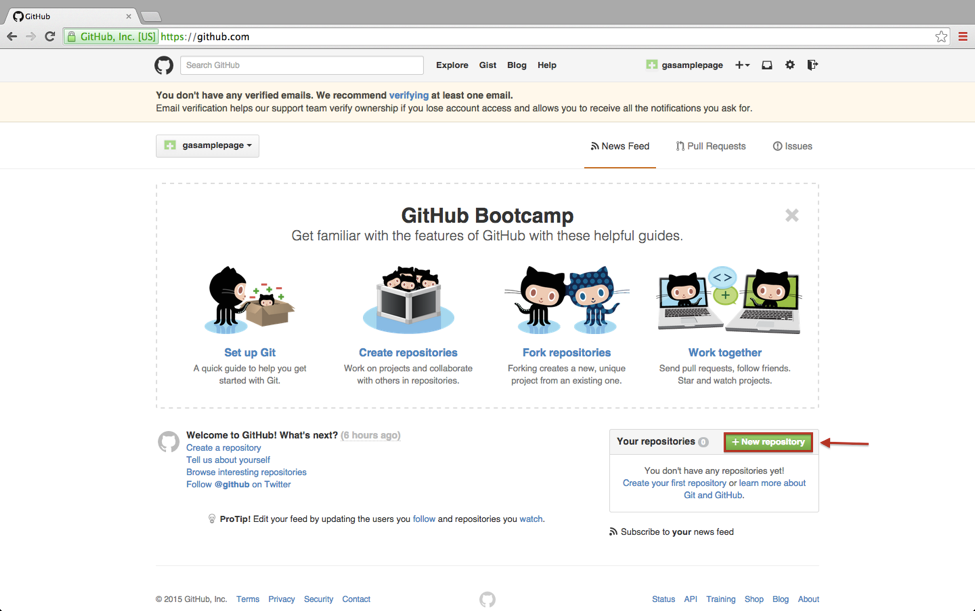

**WDI Fundamentals Unit 2**

---

## Your Turn

GitHub enables you to host and share website files online, similar to the way Dropbox or Google Drive let you store and share other types of files. GitHub hosts the files in a remote server in the cloud and gives you a working URL so that you can share your finished site with other people.

Let’s walk through this process:

### Create a GitHub account 

1. To start, let’s head over to GitHub.com. The first thing we’ll do is create a username by clicking on the field at the top right of the screen. 

 

The username you enter here will be part of the github URL for every site you host there, so choose something simple and easy to remember. Most people use their name, a pen name, or their company’s name. To simplify things, try making your username one word and all lowercase.

For this guide, we’re going to use the name “gasamplepage.” Please pick whatever name you like, for example “johnsmith123.” After selecting our username, we’ll add our email and make up a password. Then we’ll click “Sign up for GitHub.”

2. Clicking that button brings us to the following page:

 

All we need to do on this page is make sure that “Free” is chosen as our personal plan. It should be pre-selected; however, if it’s not, make sure to click on it. Then, press the “Finish Sign Up” button.

***GitHub will send you an email asking you to verify your account. Take a moment to do this now. If you do not verify your email address, your page will not work.***

### Creating a New Repository

In GitHub, the public folder in the cloud where you can store, update, and share all the files that make up your website is called a “repository”. 

1. In order to create a “repo” (as the cool kids say), click on this green button that says “New Repository.” Clicking that button should bring you to the new repository creation screen, which should look something like the following image. 

2. The first step we’ll take on this page is to name our new repository. Feel free to choose whatever name you like. Just know that if your name includes spaces, GitHub will automatically convert them into hyphens for you, since spaces aren’t allowed.

To keep it really simple for this example, we’ll just name our first repository after our user name: “gasamplepage.”

3. After naming our new repository, we don’t need to adjust any other settings, so we’ll just click on “Create Repository.”

Congratulations! You're officially a Github user, with your very own dashboard and new repository!

---

Ready for another quiz? [Let's go.](06_quiz.md)
