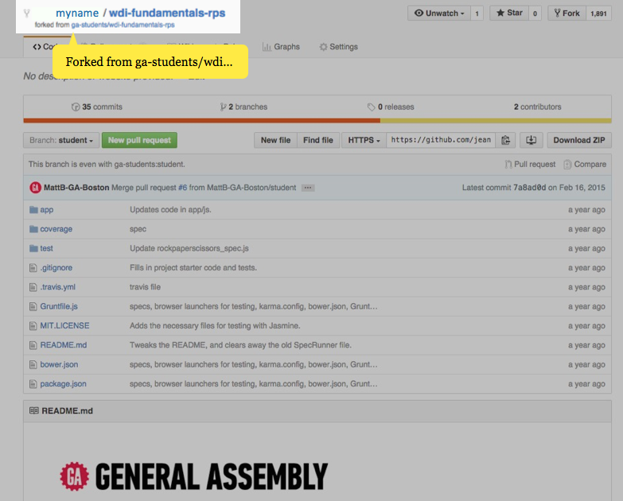
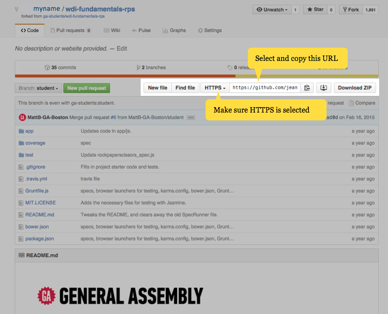

# Unit 2 Homework: Git and GitHub Preparation

As you move through the next several chapters, you will be building parts of browser memory game. Eventually, once all of the pieces are complete, your game will be turned in as your final assignment for WDI Fundamentals.*Building this memory game should take you approximately 2 hours* - this includes going through all of the individual unit exercises as you work towards the final game. Each chapter will introduce you to new tools and ideas, but it will be your job to figure out how to incorporate and use these tools to complete the assignment. In order to accomplish this, you will need to access code that is located on GitHub's servers. Follow the instructions below to get started!

## Exercise

#### Requirements

- Create a GitHub account
- Fork the WDI Fundamentals Memory Game repository
- Clone your fork locally

#### Below are the steps to complete the assignment.

1. If you don't have one already, [create an account](07_exercise.md) on GitHub.com.

2. Go to [this address](https://github.com/ga-students/wdi-fundamentals-memorygame) to find the repository containing the existing code.
  Once there, click the button that says 'Fork' - this will create a copy of the original repository under **your** GitHub account.

3. Go take a look and confirm that you now have a copy of `wdi-fundamentals-memorygame` in your list of repositories.

4. Open your fork of the repo (and note that Github lists your repo as a fork of the original repository).

  

5. Find the Clone URL listed on this page and copy it to your clipboard.

  

6. Open up the terminal application on your computer and navigate to the `fundamentals` directory within your home directory.
  Once there, run the following Git command from command line:
 
`git clone https://your/clone/url` (substituting the clone URL you copied above)
 
  This will copy your forked repo from GitHub to your computer, so that you can work on it locally.

7. If you have followed these directions correctly, now, you should have a repository in your `fundamentals` folder called `wdi-fundamentals-memorygame`. This repository contains three folders and a couple of other files.  For this project, the ONLY file we're expecting you to edit is `main.js` - it can be found at `wdi-fundamentals-memorygame/starter-code/main.js`.

---

That's it for now! We'll be coming back to this project at the end of every chapter, but now, it's time to move on to [Chapter 3](../03_chapter/intro.md).

