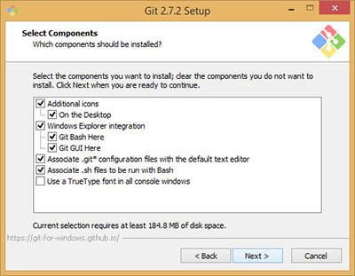
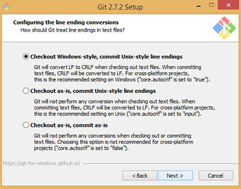

**WDI Fundamentals Unit 2**

---

# Git Bash (Windows Users)

If you're a *Windows* user, we will be installing **Git Bash**, an environment that allows you to use Bash. It will create a prompt that is similar to Mac OS X and Ubuntu Linux so you can along in Fundamentals. Once you join us for WDI, you will need to use a Mac or Linux environment. Reach out to your local producer if you have any questions.

If you're following along on *Mac OS or Ubuntu Linux*, feel free to skip the following section on installing Git Bash. You can jump ahead to the [Terminal](#terminal) section instead.

### Downloading Git Bash

* Navigate to the [Git website](https://git-scm.com/), and double click on "Windows."

* Your download should begin.

### Installing Git Bash

Follow the prompts in the installation window.

* Double click on the .exe file you just downloaded to begin set up.
* Accept the terms of use.

* Choose a location to install files.

* Select the following options in the "Select Components" prompt:

* Select a start menu folder (optional).
* Select the "Use Git from Git Bash Only" option.

* Select the "Checkout Windows-style, commit Unix-style line endings" option.

* Select "Use MinTTY (the default terminal of MSYS2)".

* Check "Enable file system caching."

* Wait for the files to install!

# Terminal (Mac OS or Ubuntu Linux Users)

**Mac/Ubuntu users:**
When you open Terminal, you will see a window like this:

> **NOTE** Practice using Spotlight to open files and applications on your computer. It'll make you more efficient as you navigate back and forth often between Terminal, your text editor, and your browser.

Open up a terminal with Bash. To do this on a Mac, press **⌘ + Space** to bring up Spotlight, then type in "terminal" and press **return**.

**Windows users:**
When you open Git Bash, you will see a window like this:

Double click on the Git Bash icon to open a new session.

---

The terminal window is where you'll tell the computer what to do, and where the computer will display its reply. Let's break this window down:

- The **prompt** is the `$` that automatically shows up on the end of the first
line. It's the command line equivalent of "standby" and indicates the terminal is
ready to accept your **command**. We'll learn a few commands later in this unit.

- The **cursor** follows the prompt, and the text you type will appear here — just
like in every other setting where you've seen a cursor.

- The **username** of the person logged in precedes the prompt. As you can see
above, this user is named *Sarah*.

---

[On to the next lesson!](text-editors-and-browsers.md)