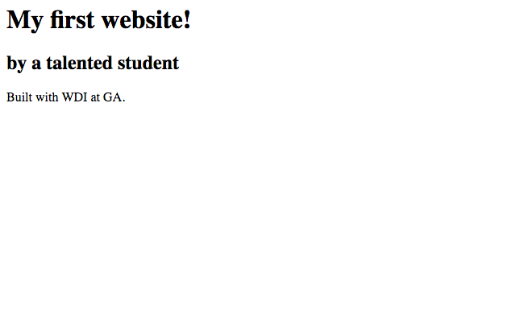

## Your Turn

Time to give it a whirl! In this exercise you'll be getting some practice opening and closing your first HTML tags.

### Instructions

Use the editor provided below to write your code below and see what it renders! Follow the steps below.

1 . Let's start with some content! Type what you see below into the HTML box down below.

```
My first website!
by a talented student
Built with WDI at GA.
```

2 .  Go ahead and open a *level one heading tag* at the very beginning where it says "My first website!"

3 . You'll notice that everything was set to h1 when you opened the level one heading tag! Ah ha! You still need to close the tag to tell the browser where to stop rendering as a heading. Go ahead and close the heading tag.

4 .Open and close *second-level heading* on the second line "by a talented student."

5 . And lastly, wrap the sentence "Built with WDI at GA." in a paragraph tag.

<a class="jsbin-embed" href="http://jsbin.com/zevojec/embed?html&height=600px">JS Bin on jsbin.com</a><script src="http://static.jsbin.com/js/embed.min.js?3.35.11"></script>

---

*Click on the output button to see what your HTML code renders. It should look like this:*

#### Checkpoint

Make sure you have:
- Opened and closed h1 tags around the site's name.
- Opened and closed h2 tags around the site's subheading.
- Opened and closed p tags around the site's body content.


Sweet! You just built a website with HTML. It's pretty basic, but you are on your way!

----
[On to the next lesson.](06_lesson.md)
