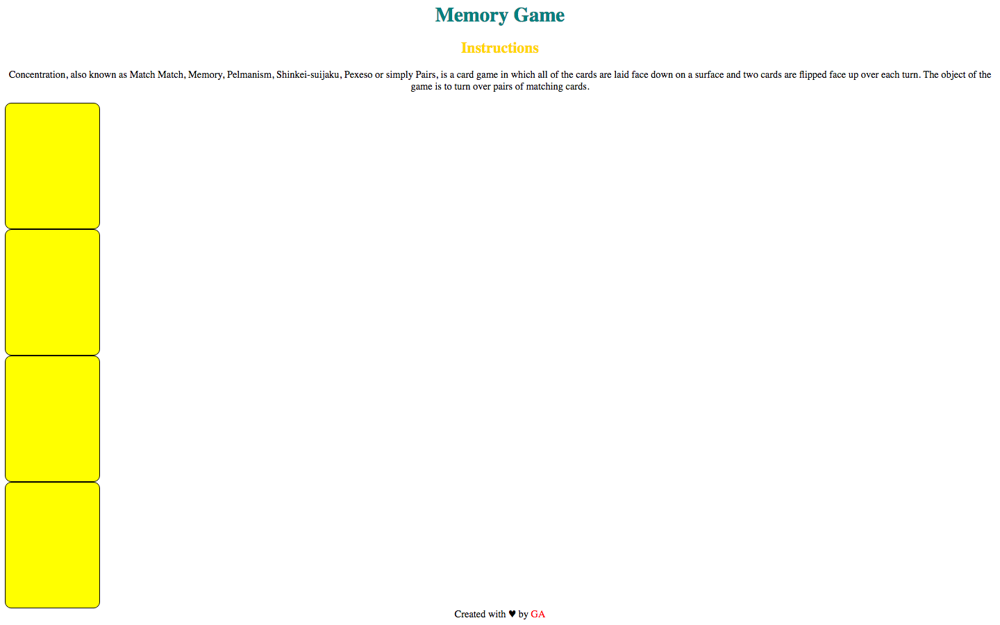

**WDI Fundamentals Unit 4**

---

# Webpage Layout

Now that we've learned about layout, we're even better equipped to format our HTML and uniquely style our memory game!

## Exercise

#### Requirements

The current state of your game could use some formatting and personalization.
* To give your webpage a nice personal touch, add a footer which includes some personalized text, something like: `Created with love by <your name>`.
* Figure out a way to throw in an icon as well and color your name a different color than the rest of the text to give it some oomph.
* Last but surely not least, give your site a nice touch by centering all of its text.

##### Below are the steps to complete the assignment.

1) Create your footer with the given text and a heart icon underneath your divs, but before your closing body tag!

*Created with &hearts; by GA*

2) Wrap the words "GA" using span tags and it give it a class of "name" so you can style it!

3) Go into `style.css` and color your name with #ff0000.

4) Finally, center the text in the body selector using the text-align property.

#### Deliverable

Ah! Things are looking better already!

