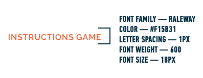
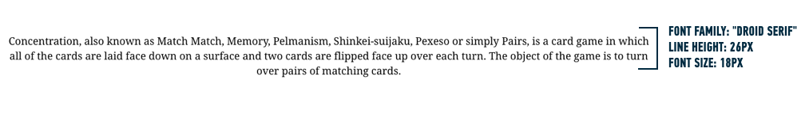

**WDI Fundamentals Unit 4**

---

# Principles of HTML & CSS

We now know how CSS plays a crucial role in the creative aspect of web development. In the following assignment, you'll use your freshly acquired skills to create the cards of your memory game and add some basic styles to the game.

As you move through the next several units, you'll build parts of a browser memory game. Once all of the pieces are complete, your game will be turned in as your final assignment for WDI Fundamentals.

## Exercise

#### Requirements

* Create cards within your memory game.
* Add color to your memory cards.
* Add an external CSS stylesheet.


##### Here are the steps to complete the assignment:

1) Open your previous `memory_game` folder in Sublime where you created your memory game HTML file.

2) Underneath your instructions and before the closing `</body>` tag, create four `img` elements with one `div` element wrapping them like so:

```html

  <div>
    
    
    
    
  </div>

```

You'll use the `div` and `img`s to create a "board" and the individual "cards" that will be displayed on the webpage.

3) Now let's add the images we'll be using for the game.
- Right click on the `memory_game` folder in the sidebar in sublime and select the "New Folder" option.
- Name the new folder `images`.
- Visit [this link](https://drive.google.com/file/d/0B3vwi9JWe-1OVW02S25tQ2ZVNVE/view?usp=sharing) to download a zip file with the images that you'll need for this project.
- After downloading the images, double-click on the zip file to unzip it, then move the **entire `images` folder** into the `memory_game` folder in Finder. Once you've moved it in Finder, you should see the folder name appear in the sidebar in Sublime text.

> Working along on Windows? To unzip all the contents of the zipped folder, press and hold (or right-click) the folder, select "Extract All", and then follow the instructions. Then move the resulting folder to the `memory_game` folder in Windows Explorer.

4) Now update the `src` and `alt` attributes for the images to the following:


```html

<div>
	
	
	
	
</div>

```

Right now all the images will display the backs of the cards, but in a later unit we will display the card face when the user clicks on a card.

5) Alright! Now it's time to add a CSS file to our project, where we can write styles for our game.

- Create a file in the `memory_game` folder named `style.css`.
- Now, go back to your `index.html` and connect your css file (`style.css`) by using a `link` tag to reference it in the `head` of your HTML file.
	
	```html
	<link href="css/style.css" rel="stylesheet" type="text/css">
	```

6) Now let's add the Google font that we will be using for this site. In the `head` of your HTML file, right before the `link` to your CSS file, add the following code:

```html
<link href="https://fonts.googleapis.com/css?family=Droid+Serif|Raleway:400,500,600,700" rel="stylesheet">
```

This link will allow us to apply the "Raleway" font family in the 400, 500, 600, and 700 font weights and the "Droid Serif" font family in the 400 font weight in our stylesheet.

Here are a couple examples to demonstrate how we can apply these fonts in our stylesheet:

```css
h1 {
	font-family: "Raleway", sans-serif;
	font-weight: 400;
}

p {
  font-family: "Droid Serif", serif;
}
```

7) Now switch to your `style.css` file. Apply styles to the site using the images under the "Deliverable" section below as a reference for font sizes, colors, layout, etc. 

> **Hint:** Hint: to align all the content to the center at once (including the card images!), try applying the `text-align` property to the `body` element, like so:
> 
> ```css
> body {
> 	text-align: center;
> }
> ```
> 


---

#### Deliverable








Great! Your website is starting to look more and more like an actual memory game.


---

[On to the next unit.](../05_unit/layout-basics-intro.md)
