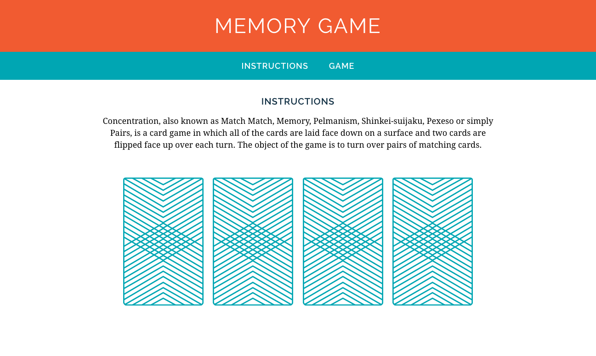

**WDI Fundamentals Unit 5**

---

# Layout Basics Assignment

Now that we've learned about layout, we're even better equipped to format our HTML and uniquely style our memory game!

## Exercise

#### Requirements

Our game could use some additional styling to make different portions of the page stand out. 

In this assignment you will:

- Add structure to the HTML using semantic elements.
- Give the `header` and `nav` a `background-color` to make them stand out.
- Center the `main` content on the page.
- Adjust the spacing around elements using `padding` and `margin` to give the layout some breathing room.

##### Below are the steps to complete the assignment:

0. First let's provide a little more structure to our page. In the `index.html` file for your `memory_game` in Sublime Text, wrap the `h1` with a `header` element.

	- Here's what it looks like to "wrap" an element with another element:

		```html
		<header>
			<h1>Memory Game</h1>
		</header>
		```

0. Now wrap the two navigational anchors &mdash;  "Instructions" and "Game" &mdash; with a `nav` element.

0. Finally, wrap the rest of the content &mdash; including everything from the heading that reads "Instructions" to the images of the cards &mdash; with a `main` element.

0. Alright! Now that we've added some structure to our HTML content we're ready to add some additional styles. Complete the following steps in the `style.css` file in the `memory_game` folder in Sublime Text.

0. Select the `header` element in your CSS and give it a `background-color` of `#F15B31`, `30px` padding on the top and bottom, and `20px` padding on the right and left.

	- _Check your progress in your browser as you complete each step_. To do so, switch back to your `index.html` file, right-click anywhere within the HTML file, and select the "Open in Browser" option.

0. Some browsers give the body a `margin` by default, which will create a bit of space around the edges of the page. We want to remove this margin since we want our `header` background to touch the edges of the browser window. Apply the following style to the `body` selector in your `style.css` file to remove this margin: `margin: 0;`.

0. Now find the styles you are applying to the `h1`. We also want to remove the margin from the `h1` so that our header takes up a little less space. Set the `margin` for the `h1` to `0`.

0. Now let's add some styles to the `nav`. Give the `nav` element a `background-color` of `#00A6B3` and `20px` padding on the top and bottom.

0. The anchors in our `nav` are a little too close together! Give the `a` elements `20px` margin on the right and left sides.

0. Now let's center the `main` content of our page. Give `main` a `width` of `850px`. Add `35px` margin to the top and bottom of `main` and set the left and right margins to `auto` to center the main section.

0. Our card images also look like they are spaced a little too tightly. Give each `img` `40px` `margin` on the top, and `8px` `margin` on the right and left.


#### Deliverable

Nice — our game is really coming along!




---
[Take a quick feedback survey to help us improve Fundamentals.](pulse-check.md)