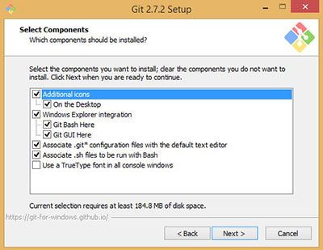

**WDI Fundamentals Unit 6**

---

##### By the end of this unit, you'll be able to:
* Differentiate between a command line interface and a graphical user interface.
* Summarize a basic file system structure.
* Open a file in a text editor and make changes from the command line.
* Identify when you'd want to use absolute versus relative paths.

## Think Like a Programmer

Most computer users move their mouses, click on icons, and drag and drop files from one folder to another.

When you're using the computer this way, you're using what's called a Graphical User Interface, or GUI. In a GUI (pronounced "gooey"), you communicate with your computer using a combination of text, images, and gestures.

But you are on a journey toward transcending ordinary computer users. You're becoming a developer, and developers like to interact with computers in a different way — through the command line interface (CLI).

Unlike the GUI, the command line is a *text-based interface*, where you communicate with your computer using text alone.

Until the video display was introduced in the mid-1960s, the command line was the only way to interact with a computer. Today, the CLI is still preferred by programmers because it is explicit, simple, and (most importantly)
fast. In fact, once you become comfortable using the CLI, you'll be amazed at how much more productive you become!

We can perform actions using the command line by **entering commands**, and there is a command to perform virtually any action you can imagine. There are commands to open an application, create new files, copy files from one place to another, and more.

We'll access the command line using a terminal application, which can be found on all computers. Terminal applications are commonly known as "shells," and we'll learn to use the default shell provided on Mac OS X and Ubuntu Linux, **Bash**.

There are many different types of shells, and some are more similar to Bash than others. Fundamentals will not explore the shells that come with Windows computers, for example, because they use a different set of commands.

## Getting Started with Git Bash (Windows Users)

If you're a *Windows* user, we will be installing **Git Bash**, an environment that allows you to use Bash. It will create a prompt that is similar to Mac OS X and Ubuntu Linux so you can along in Fundamentals. Once you join us for WDI, you will need to use a Mac or Linux environment. Reach out to your local producer if you have any questions.

If you're following along on *Mac OS X or Ubuntu Linux*, feel free to skip the following section on installing Git Bash. You can jump ahead to the [Getting Started Using Terminal](#terminal) section instead.

### Downloading Git Bash

* Navigate to the [Git website](https://git-scm.com/), and double click on "Windows."

* Your download should begin.

### Installing Git Bash

Follow the prompts in the installation window.

* Double click on the .exe file you just downloaded to begin set up.
* Accept the terms of use.

* Choose a location to install files.

* Select the following options in the "Select Components" prompt:

* Select a start menu folder (optional).
* Select the "Use Git from Git Bash Only" option.

* Select the "Checkout Windows-style, commit Unix-style line endings" option.

* Select "Use MinTTY (the default terminal of MSYS2)".

* Check "Enable file system caching."

* Wait for the files to install!

## Get Started Using Terminal

**Mac/Ubuntu users:**
When you open Terminal, you will see a window like this:

> **NOTE** Practice using Spotlight to open files and applications on your computer. It'll make you more efficient as you navigate back and forth often between Terminal, your text editor, and your browser.

Open up a terminal with Bash. To do this on a Mac, press **⌘ + Space** to bring up Spotlight, then type in "terminal" and press **Return**.

**Windows users:**
When you open Git Bash, you will see a window like this:

Double click on the Git Bash icon to open a new session.

---

The Terminal window is where you'll tell the computer what to do, and where the computer will display its reply. Let's break this window down:

- The **prompt** is the `$` that automatically shows up on the end of the first
line. It's the command line equivalent of "standby" and indicates Terminal is
ready to accept your **command**. We'll learn a few commands later in this lesson.

- The **cursor** follows the prompt, and the text you type will appear here — just
like in every other setting where you've seen a cursor.

- The **username** of the person logged in precedes the prompt. As you can see
above, this user is named *Sarah*.

---

[On to the next lesson.](02_lesson.md)
