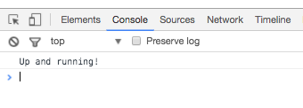

**WDI Fundamentals Unit 7**

---

# Unit 7 Assignment

Now that we've covered variables and data types, we can write code that simulates the cards in our memory game.

## Project Setup

#### Adding a JavaScript File

You have already written the required HTML and CSS in previous units; you'll want to use that code moving forward for each unit's assignment.

First let's set things up so we can start writing JavaScript for the Memory Game.

0. Open up Sublime Text Editor.
0. Create a new folder called `js`.
0. Within the `js` folder, create a file called `main.js`.
0. You'll also want to link your `index.html` file to the `main.js` file.
	- Copy the line with the `script` element below.
	- Place this in your `index.html` file, right before your closing `</body>` tag.

	```html
	...
	 
		<!-- Copy the below line -->
		<script src="js/main.js"></script>
		<!-- Place it right before the closing body tag -->
	</body>
	</html>
	```
0. Make sure to save your `index.html` file.

>**Note** **Where To Add Script Tags**: Unlike using a `link` tag for linking CSS files, you should add your `script` tags right before the closing HTML `body` tag (`</body>`). This ensures that all of the elements and styles on your page have been loaded and are available to the browser before the `script` tags are read.

#### Using Chrome's Console

Now let's test things out to make sure the JavaScript file is hooked up correctly:

0. Add the line of code below to the `main.js` file in Sublime Text:

	```js
	console.log("Up and running!");
	```
0. Save the `main.js` file.
0. Open `index.html`, right-click anywhere in the file, and select "Open in Browser." You'll want to use Chrome to test things out.
	- If Chrome is not your default browser, copy the url from another browser, open Chrome, and paste the url in the url bar.
0. In Chrome, go to `View > Developer > Developer Tools`.

0. Make sure the "Console" panel is selected and you should see the message "Up and running!" in your console.



> We'll be using the console to check our results as we work. The steps will be the same each time you need to open the console. If you'd like to make Chrome your default browser, you can follow instructions [here](https://www.quora.com/How-can-I-set-Chrome-as-my-default-browser).

<br>


## Exercise

#### Requirements

Now you'll be working to create the cards that will make up your memory game. Each card will have a value of `"queen"` or `"king"`, and there should be a total of four cards. You'll also push your code up to your repository.


#### Instructions

0. Navigate to the `main.js` file in Sublime.

0. Create four variables that simulate the cards in your game.
	- They should be `string` types.
	- Two should have a value of `"queen"`, and the other two should have a value of `"king"`.
	- They will represent your cards (e.g., `"queen"` card).
	- Name your variables `cardOne`, `cardTwo`, `cardThree`, and `cardFour`.
	- Here's an example of one card:

		```js
		var cardOne = "queen";
		```

0. Now we'll use `console.log()` to display the value of two cards, which will represent the cards that the user has flipped over.
	- Use `console.log()` to display the values of **two** cards (you can pick which two cards you'd like to display).
	- Here's what this should look like:

		```js
		console.log("User flipped " + cardOne);
		```
	- Notice how we use string concatenation (`+`) to add the human-readable text `"User flipped "` with the value of a variable.

0. After saving any changes to `main.js`, open your `index.html` file in Sublime Text, and then open the file in Chrome. After the web page loads, you can go to `View` > `Developer` > `Developer Tools` and click on the console panel. You should see two messages displayed in the console!

	 >**_Reminder_** Because you're working within the JavaScript file, `main.js`, which is connected to your `index.html` file, you can open the `index.html` in the browser and run this code directly in the console to see the results of your executed JS.
	 
Nice work!

#### Deliverable:


#### Pushing Code Up to the Repository

In order to back up your code and track your work, you'll want to commit the changes you've made to the project's repository. You'll have to open up the terminal and `cd` into the correct folder that holds the cloned repository for this assignment. Once you're there, complete these three steps:

0. Stage your code.

	`git add -A`

0. Create a version of your staged code.

	`git commit -m 'created game logic'`

0. Push your code to the GitHub repository.

	`git push origin master`


---
Think you've got it? [Get a start on the next unit.](../08_unit/control-flow-intro.md)