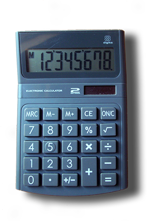

**WDI Fundamentals Unit 8**

---

# Data, Operators, and Expressions

Chances are, you've probably played around with a scientific calculator at some point in the past. You punch in a big number (for example, 9876435),
then `x`, and then another big number (say, 373848221), and hit the `=` button. Then, 
the calculator spits back a result (in this case, 3692287654572135).

That information we type into the calculator is called an **expression**: a
collection of values (*12345*) and operations (like `+` or `x`).

The process of reducing this expression down to a single value is called **evaluation**.

The JS Bin console is similar in many ways to a scientific calculator. It accepts an
expression (in JavaScript) from its user and attempts to evaluate that expression,
yielding a single value.

Before we tackle fully fledged JavaScript expressions, let's look at their
two components: data and operators.

 

## Data (a.k.a., Values)
Calculators can only operate on numbers, but computers can perform calculations
on many different types of data, including:

* **Numbers**: This is pretty self-explanatory. Some languages draw a distinction between integers (whole numbers) and floating point numbers (decimals), but in JavaScript, they're considered the same. 
<u>Examples</u>: `20`, `-4.5`, `300`, `99.99`

* **Strings**: Strings are groups of characters (either letters, numbers, or special characters such as punctuation, spaces, or parentheses). They come in two varieties, <code>'single-quote'</code> (sometimes called 'string literals') and <code>"double-quote"</code>. Although there are some differences between the two, don't worry about them for now. Strings are typically used to store text for people to read. <u>Examples</u>: <code>'hello'</code>, <code>'goodbye'</code>, <code>'moc.liamg@gmail.com'</code>

* **Booleans**: This one is probably new for you. Boolean-type data only has two
possible values, `true` or `false`.

If you forget which type of data you're dealing with, you can run the `typeof`
command. Try typing the following lines into the JS Bin console tab and hit `enter`. What responses do you get?

* <code>typeof 'hello';</code>
* <code>typeof 24;</code>
* <code>typeof 3.45;</code>
* <code>typeof true;</code>

> **HINT**  You may have noticed that each of those lines ended in a `;` — in
> JavaScript, a semicolon is used to denote the end of a line. Although your code
> may execute without them, there may be cases where a missing semicolon could cause
> unexpected results. It's best to just get in the habit of using them.

### Test Yourself
Try to predict the types of each of the following bits of data. Check your answers
with `typeof` in the JS Bin console tab:

* <code>24</code>
* <code>'99'</code>
* <code>'true'</code>
* <code>false</code>

## Operators
Of course, having data that simply sits around isn't very useful. Operators take
values as their inputs (also known as **arguments**) and produce new data as their outputs.
There are *many* different operators, but here are some of the most common:

* **Arithmetic** (`+`, `-`, `*`, `/`): These operators all work as you'd expect. In the expression `2 + 2`, the `+` operator takes both `2`s as inputs and causes the whole expression to evaluate to `4`.

>**Note** When given string arguments, the `+` operator actually behaves
differently — it "concatenates" two strings together to make one big string.
 <u>For example</u>: <code>'Hello' + ' ' + 'Bob'</code> will evaluate to <code>'Hello Bob'</code>.

* **Modulus** (`%`): Remember remainders? For example, `5` divided by `3` equals `1` with a remainder of `2`. The modulus operator takes two numbers as its inputs and returns what's leftover from the division.
 <u>For example</u>: `15 % 4` will evaluate to `3`.

* **Comparison** (<code>></code>, <code><</code>): These operators take two numbers as inputs, but, unlike the previous operators, they return *Boolean* values.
 <u>For example</u>: <code>5 > 1</code> will evaluate to `true`, while <code>10 < 5</code> will evaluate to `false`.

* **Equality** (`===`) : This operator will accept any two types of data as inputs and (just like the comparison operators) evaluate to a Boolean value. It will only evaluate `true` if both sides are completely identical in data type and value.
 <u>For example</u>: <code>5 === 5</code> will evaluate to `true`, while <code>5 === '5'</code> will evaluate to `false`.

* **Inequality** (`!==`) : This operator will also accept any two types of data as inputs and evaluate to a Boolean value. It is essentially the reverse of the equality operator — it compares two values to check that both the data type and value are *not* the same.
 <u>For example</u>: <code>5 !== 5</code> will evaluate to `false`, while <code>5 !== '5'</code> will evaluate to `true`.

* **Logical Operators** (`!`, `||`, <code>&&</code>): These operators both take and return Boolean values.
    * NOT (`!`) will reverse the value of any Boolean
       ( `!true` // `false`).
    * OR  (`||`) takes in two Boolean arguments. If at least one is `true`, then it will evaluate to `true`. But, if both are `false`, it will evaluate as `false`.
    * AND (<code>&&</code>) also takes in two Boolean arguments; however, it will only evaluate as `true` if both of the arguments are `true`. Otherwise, it will evaluate to `false`.

### Test Yourself
Can you predict the results of the following operations? Check your answers against the console in JS Bin.
* <code>true && false;</code>
* <code>45 % 6;</code>
* <code>8 === 8.0;</code>
* <code>'Hello' + ' ' + 'World';</code>

## Expressions
So, what happens when we bring several of these operators and values together?

Consider the following expression:

`(2 + 3) * (9 - 8)`

In order to perform the multiplication, we need to first know what we're multiplying. The `*` operator must wait until both of the expressions in parentheses are evaluated before it can proceed.

We can represent this chain of dependencies using a logical structure called a `tree`.

 

To evaluate any point (or "node") in the tree, you simply (1) evaluate that node's left "child," and then (2) evaluate its right "child." In this case, to evaluate at the `*`, we first evaluate the `+` node, then the `-` node.

What happens if we're dealing with a more complicated expression? Say:

`((9 + 2) * 25) - 5`

Because the `-` requires ((9 + 2) * 25) to be evaluated in order to perform the subtraction, `-` will be at the top of our expression tree. Here is the full tree: First, we perform the addition, then the multiplication, and then finally the subtraction.

 

One last tricky one: `1 + 1 + 1 + 1`. Obviously, we know that this expression is equal to 4. But what does its tree look like?

In this case, we actually need to look to the rules of math (and anyone interested in some in-depth reading on the subject can [check out this Wikipedia page](http://en.wikipedia.org/wiki/Operator_associativity)). As it turns out, mathematical expressions are actually evaluated ***from left to right***. In other words, given the expression `10 - 5 + 2`, we interpret this as `(10 - 5) + 2`, or `7`, rather than `10 - (5 + 2)`, or `3`.

Following this rule, our expression of `1 + 1 + 1 + 1` could also be written as `((((1) + 1) + 1) + 1)`. Is it easier to see the tree now?

 

While we've covered what seems like a lot of math in this section, don't worry – you're not going to be doing calculus in this course. It's important that we review these concepts, because there will be many times when you'll solve a problem by using one of their basic principles. When it comes down to it, computers operate with a simple, straightforward logic.

---

Think you've got it? [Let's cement what we've learned with an exercise.](05_exercise.md)
