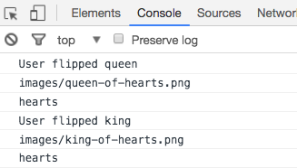

**WDI Fundamentals Unit 10**

---

# Unit 10 Assignment

Our memory card game is starting to take shape! Now that we've covered objects we have a better way to represent our cards. For example, maybe we want to associate a suit with a card or store a path to where the image for that card's face is stored. We'll work on adding this functionality in this assignment.


## Exercise

#### Requirements

For this unit's assignment, you will be creating an object for each card that will store that card's name, the suit, and a path to where the image for that card is stored in our project. 

You'll then update any code from the last assignment that was accessing values from the cards array so that we are accessing values from that specific card object.

#### Instructions

0. First let's add some extra information to each card by storing an object for each card in our `cards` array. Open the `memory_game` folder in Sublime, then open the `main.js` file you worked on in the last assignment and complete the following steps: 
	- Delete the four strings from the `cards` array.
	- In the cards array, create four objects, one for each card.
	
	> Hint: Here's the syntax for creating an array that contains objects:
	>
	>```js
	>var myArray = [
	>	{
	>		color: 'red',
	>		flower: 'rose',
	>		petals: 20
	>	},
	>	{
	>		color: 'blue',
	>		flower: 'violet',
	>		petals: 6
	>	}
	>];
	>```
	- Here is what each object should look like:

| `rank` |  `suit` |  `cardImage`        |
| ------------- |:-------------:| ------------- |
| `"queen"`      |   `"hearts"`     |`"images/queen-of-hearts.png"` |
| `"queen"`      |   `"diamonds"`     |`"images/queen-of-diamonds.png"` |
| `"king"`     |   `"hearts"`   |`"images/king-of-hearts.png"` |
| `"king"`     |   `"diamonds"`   |`"images/king-of-diamonds.png"` |

2\. Now that we have our card objects, we'll want to update lines of code where we were accessing values from the `cards` array to reflect these changes.
- In the `flipCard` function, find this `console.log` statement: `console.log("User flipped " + cards[cardId]);`
- Update the portion `cards[cardId]`. Right now, this code is accessing the entire first object in the `cards` array. You'll want to update this code so that we are accessing the `rank` property of this object.
  
> Hint: We'll give you this one, and you can use this as a reference for the next two steps. Update this to `cards[cardId].rank`.

- Next update the `cards[cardId]` portion of `cardsInPlay.push(cards[cardId]);`. You'll want to push the name of the card ("queen" or "king") to the `cardsInPlay` array.
  
> Hint: You'll want to use the `rank` property like we did in the last step.

- Now let's add a bit of new code so that we can "see" the cards that are flipped in our console. Add two `console.log()` statements. One should log the `cardImage` and the other should log the `suit` for the flipped card.


3\. Save your `main.js` file, open the project in Chrome and open the console. Make sure that the `"User flipped queen"` and `"User flipped king"` messages are still displayed. You should now also see the image paths and suits displayed.

#### Deliverable

Here's what your console should display:



Here's what the alert that pops up should display:


#### Pushing Code Up to the Repository

In order to back up your code and track your work, you'll want to commit the changes you've made to the project's repository. You'll have to open up the terminal and `cd` into the correct folder that holds the cloned repository for this assignment. Once you're there, complete these three steps:

0. Stage your code.

	`git add -A`

0. Create a version of your staged code.

	`git commit -m 'created game logic'`

0. Push your code to the GitHub repository.

	`git push origin master`
	

---

[Onto Unit 11!](../11_unit/dom-intro.md)
