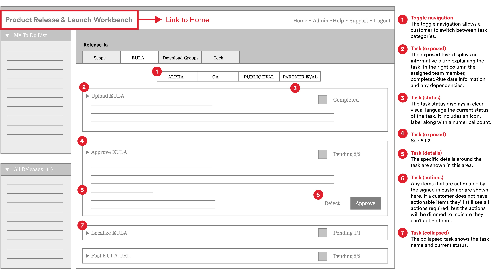

**WDI Fundamentals Unit 1**

---

# Intro to Programming Languages

In the next few units, we'll learn about the three front-end languages: HTML, CSS and JavaScript. Before we dig in, let's take a look at the web ecosystem and how these languages fit in.

## Web Production Workflow

#### How does an idea become a fully-developed website? 

Building a website begins with **User Experience Design**, often called UX Design or simply UX. The goal of UX Design is to make the site easy and exciting to use. A UX Designer will analyze the larger purpose of the site, and create sketches called wireframes that detail out every functionality the site needs in order to fulfill that purpose. Wireframes show how a user can navigate the different pages and sections of a site using basic layout and annotations. Wireframes are the blueprints of a website.

When the wireframes are complete, they're often passed off to the **Visual Design** and **Developer** teams simultaneously. Visual Designers decide how the site will look using layout, color, typography, images, video and more. Visual design is an important aspect of the web production process– not only for beautifying the web– but because certain design elements can largely impact the usability of the site.

As a general rule, a Developer team consists of **front-end** and **back-end** developers. Front-end developers bring the designs to life with HTML, CSS, and JS. Back-end developers give the website a "memory" by storing data using languages like PHP, Python, and Ruby.

## Front End vs Back End

Let's talk in more detail how the front end differs from the back end. Think of a web app like a retail clothing store.

The front end is the store itself — it contains the things with which the buyer interacts. The store has an efficient structure (HTML); it has been fashionably styled and lit (CSS); and you can interact with it by trying on or purchasing clothes (JavaScript).

Then, there are all the parts of the store you don't see: the loading dock where products are shipped, the break room where the staff schedule is posted, or the office where the accountant handles the finances. This is the back end of the store.

#### Front-end Languages

The "Three Amigos" or the three front-end languages are HTML, CSS, and JavaScript.

- **HTML** is like a noun: responsible for defining the content on the page, like images, headers, and paragraphs.
- **CSS** is like an adjective: responsible for describing styles like layout, size, and color of the content.
- **JavaScript** is like a verb: responsible for the behaviors and actions of the content, like drop-down menus.

#### Back-end Languages

Unlike the front end, which has only three languages, there are multiple back-end languages for the web: Ruby (Ruby on Rails), Node.js, PHP, Python, C++, and more. Java is another back-end language you may have heard of. Java is _not_ JavaScript! Many novice programmers confuse the two, but they have very different functionalities.

Responsibilities of the back-end developers include:

- Giving the application/webpage a 'memory': storing data, like usernames and passwords
- Talking to the database: getting, adding, removing, and updating data; like password resets
- Handling page requests: sending the correct page to the user, like a version of the home page where the user is logged in vs logged out
- Authenticating users: enabling users to access different areas of a site, like logging into an account

#### Front End and Back End Together
Let's imagine a user has logged in to their bank's website to view the balance on her checking account. Everything she sees on the screen is front-end code.

When she selects 'Checking Account', the back-end code kicks in. The website now finds her user information, which has been stored in a database. 

The server returns a response containing our user's checking account information. Then the front end takes over once again, displaying her information with HTML, CSS, and JS.

## Test yourself

Objective: Distinguish Between HTML, CSS, and JS

Visit lyft.com. Try to fill in these blanks:

1. The words "A Ride in Minutes" appear due to ______?
2. The reason for which "A Ride in Minutes" is on the left half of the screen and white is due to _______?
3. Hover over the word "Explore" in the navigation menu. That animation is most likely due to _______?

---

Now that we've seen how HTML, CSS and JavaScript fit together, let's take a look at how you can start to [think like a developer](think-like-a-developer.md)
