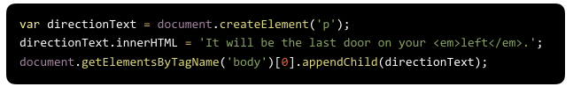
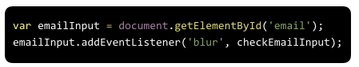

**WDI Fundamentals Unit 11**

---

#### Typeform Admin Link: 

https://admin.typeform.com/form/3050155/fields/#/

#### Typeform Embed: 

---

*Question 1*

Which of the following does NOT describe the DOM:

- The DOM allows you to find elements.
- The DOM allows you to get and set content.
- The DOM allows you to add animations and effects.
* The DOM allows you to write HTML and CSS directly into the browser.

_Response_

Primary aspects of the DOM include:

1) The DOM allows you to find elements.
2) The DOM allows you to get content.
3) The DOM allows you to set content.
4) The DOM allows you to add animations and effects.
5) The DOM allows you to create event listeners.

---

*Question 2*

The browser pulls in HTML documents, parses them, and creates object models of the pages in its memory - the DOM.

Each element in the HTML document is represented by a ___.

- DOM Branch
* DOM Node
- Array of properties and methods
- DOM Type object

_Response_

Each element in the HTML document is represented by a DOM node.

You can think of a node as a live object you can access and change using JavaScript. When the model is updated, those changes are reflected on screen.

---

*Question 3*

Which of the the following is not a valid input into document.querySelector()? 

- li
- h1
- .yellow
* All of these inputs are valid

_Response_

All of these are valid inputs for this code. When using the querySelector() method, we can use any of our CSS-style selectors.

---

*Question 4*

Which method allows us to find and locate an element by the value of its id attribute? 

* getElementById()
- locateElementId()
- idSelector()
- elementSelector()

_Response_

.getElementById() is the method that allows us to find and locate an element by the value of its id attribute (as you can deduce from its name).

---

*Question 5*

What is NOT a method we can use to search and find multiple elements at once?

- getElementsByClassName()
- getElementsByTagName()
* querySelector()
- querySelectorAll()

_Response_

When using the querySelector() method, if there are multiple elements on a page that match the selector it will return only the _first_ of those matching elements.

*Question 6*

Look at the code block below. Which of the following lines of code would allow us to select the first list item? 

- document.getElementsByTagName('li')[1]
* document.querySelector('li')
- document.li("1")
- document.querySelectorAll('li')[1];

_Response_
We can use the querySelector() method to select the first list item. This method will return only the _first_ of any matching elements.

document.querySelector('li')

---
*Question 7*

Which of the following methods can remove attributes from elements?

* removeAttribute()
- deleteAttribute()
- removeElementsByName()
- deleteElementsByName()

_Response_

We can use the .removeAttribute() method to remove attributes from elements.v

---

*Question 8*

The code below will add an HTML element to a webpage. What will the element that gets appended to the body look like? 

* 
It will be the last door on your <em>left</em>.
 
- It will be the last door on your <em>left</em> 
- <li>It will be the last door on your <em>left</em></li> 
- 
It will be the last door on your left

_Response_

The element that gets appended to the body will look like this:

It will be the last door on your <em>left</em>.
 

---

*Question 9*

What does 'blur' refer to in the code block below?

- It is the name of a function.
- It selects an element that has the class 'blur'.
* It is the type of event we are listening for.
- It is the name of a variable.

_Response_

**blur** is the type of event we are listening for. This event fires when the element loses focus.

---

*Question 10*

Why is JavaScript considered an event-driven language? 

- It's a programming language that allows you to create events fluidly with other programming languages.
- It's a programming language that executes code line by line and then forgets the code.
- It's a programming language that waits for other languages to execute first.
* It's a programming language that waits and listens for any event triggers for which you’ve programmed it to watch.

_Response_

JavaScript is event-driven because it waits and listens for events (i.e., user actions).

---

*Question 11*

What does **this** refer to in the following example:

* The button with the id submit-btn that the user interacted with, causing the alertUser function to run
- The event 'click' within the document
- The backgroundColor "red"
- The document itself

_Response_

When a callback function is executed within the context of an event handler, it is the element (the DOM node) that owns the context.

So in this case, this will refer to the element that we selected when we set up our event handler - the button with the id #submit-btn.