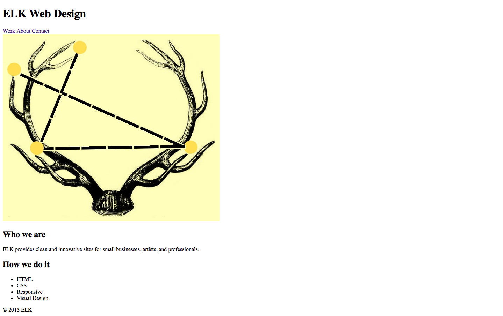

**WDI Fundamentals Unit 5**

---

## Your Turn

### Headers, Navs, and Footers Exercise

In this exercise, you'll learn the basics of laying out a webpage while building a small business website for ELK Web Design! The final design is based on an assignment submitted by a Front-End Web Development graduate, Lauren Kathe, and looks like this:


This design has four sections:

* Header
* "About" section
* "Services" section
* Footer


This exercise has two sections. First, we'll create the structure of the website. Then, we'll add CSS. 
If you don't see the JS Bin below, please refresh the page.

<a class="jsbin-embed" href="http://jsbin.com/kigeyu/embed?html,css,output">Elk Web Design on jsbin.com</a><script src="http://static.jsbin.com/js/embed.min.js?3.40.3"></script>

#### Section 1: Content and Page Structure
Your job is to use the notes below to write the HTML for ELK Web Design.

1) **The Header:** 

ELK Web Design has a `header` element inside the `body` which contains:

- The company name, ELK Web Design, as a level 1 heading, or `h1`. 
- A `nav` element, with three linked menu items: "Work", "About", and "Contact."
	- For now you can simply wrap placeholder anchors around each `nav` item with a `#` as the value for the `href` like so:

	```html
	<a href="#">Work</a>
	```
	
- The `header` also contains this image: `http://i.imgur.com/pdsjjxD.jpg`.

2) **The Body**

Inside the `body` there are two `section`s. One section is for the "About" content, the other for "Services". The section headings are level 2, or `h2`.

_About Content_:

* level 2 heading: Who we are
* paragraph: ELK provides clean and innovative sites for small businesses, artists, and professionals.

_Service Content_:

* level 2 heading: How we do it
* unordered list: HTML, CSS, Responsive, Visual Design

3) **The Footer**
  
paragraph: "&copy; 2017 ELK"


Here's how the page looks without any styling:


#### Section 2: Styling Content

Flip over to your CSS tab.

0. Apply the following styles to the `body`: Set its `font-size` to `18px` and the `font-family` to `Arial`.

0. Write a rule for `h1`, and set its `font-size` to `36px`.


0. Create a rule for `h2`, and set its `font-size` to `27px`.
	
0. Use only one `padding` declaration to give `h2` a top and bottom `padding` of `14px`.
	
0. Create a rule for both `h1, h2` and set its `text-transform` property to `uppercase`.
	
0. Let's keep styling both headings. We'll use CSS shorthand to "underline" each one with a `border-bottom`. Give `h1, h2` a `border-bottom` property that's `4px` thick, `solid`, and `black`.
	
0. Set `h1, h2`'s `display` to `inline-block`.

	- Although we haven't covered `inline-block` in Fundamentals, here setting the `h1` and `h2` to have a `display` of `inline-block` will make it so the border we added in the last step is only as wide as the element itself &mdash; instead of stretching across the entire page.
	
0. Create a style for `img` elements, setting the `display` property to `block`.
	
0. Center all images on the page horizontally by setting `img`s `margin` to `0 auto`.

	- Setting left and right margins to `auto` is a common way to center `block` elements. Here we are using the shorthand for the `margin` property (`margin: 0 auto;`) to set the top and bottom margin to `0` and the left and right margins to `auto`.
	
0. Create a `ul` style, and set its `list-style` to `none`. Set its `margin` to `0` and its `padding` to `0`.

	- Setting the `list-style` to `none` will remove the bullet points in a list.
	
0. Create a `footer` style in your CSS, and align its text to the center.
	
0. Set the `footer` `padding` to `18px 0`.


Here's what your webpage should look like in the output now:


All done for now!

> Stuck? Check out the [solutions](../exercise-solutions.md#semantic-elements) for assistance.


---
[Ready to test your knowledge?](layout-basics-quiz.md)
