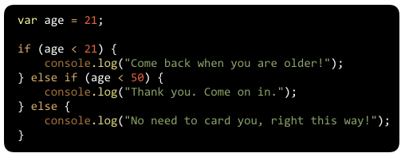

**WDI Fundamentals Unit 8**

---

#### Typeform Admin Link: 

https://admin.typeform.com/form/2905727/fields/#/

#### Typeform Embed: 

<!-- Change the width and height values to suit you best -->

---

*Question 1*

What will the last statement in the code below evaluate to?

- true
* false

_Response_

The strict equals sign === checks to make sure that both the value and the data type are the same.

Here the values of x and y are the same, but x is a string and y is a number, so the answer is **false**.

<!--AMY: can you bold the things within stars for all quiz questions/ answers instead of actually typing in the stars? So that this line is easier to read. Thanks!-->

---

*Question 2*
What will be logged to the console?

- "Come back when you are older!"
* "Thank you. Come on in."
- No need to card you, right this way!"
- None of the above

_Response_

Age is not less than 21 so the first console.log statement is skipped. 

Since age is less than 50, the second console.log statement is executed and the corresponding message, "Thank you. Come on in!" is shown. 

The final console.log statement is skipped.

---

*Question 3*

Take a look below. What condition would you replace /* Your Expression */  with to print the text "I need to buy food now!" to the console?

Let's assume that you need to buy food if you're hungry AND there is NOT food in the fridge.

* isHungry && !foodInFridge
- !isHungry && foodInFridge
- isHungry || !foodInFridge
- isHungry && foodInFridge

_Response_

The condition to check whether you are hungry AND there is NOT food in the fridge would look like this:

isHungry && !foodInFridge

---

*Question 4*

Take a look at the following code. What will be logged to the console?

- "flower costs $2.50"
- "flower costs $1.50"
- "orchid costs $1.25"
* "orchid costs $1.50"

_Response_

The flower variable holds the value "orchid" so the switch statement would execute the first case that is equal to "orchid". 

<!--AMY: The markdown formatting below this line was off because of that dollar sign so I put backticks here, but these should be removed for typeform. Thanks! -->

Therefore, `"orchid costs $1.50"` will be logged to the console.

---

*Question 5*

Take a look at the following code. What will be logged to the console now that the **flower** variable holds the value **"tulip"**?

- "flower costs $2.50"
- "tulip costs $1.50"
* "We do not carry this flower."
- None of the above

_Response_

The flower variable holds the value "tulip" so the switch statement would execute the first case that is equal to "tulip". 

Since no cases are equal to "tulip", the default block will run.

---

*Question 6*

In JavaScript, how would you access the second element of an array called **fruit**?

- fruit[2]  
- fruit(2)  
* fruit[1] 
- fruit(1)

_Response_

To access the second element of an array, you would need to use bracket notation: 
 
my_array[1]

Remember that our arrays are zero-based so the second element has an index of 1.

---

*Question 7*

Given the array below, what would **ages[2]** evaluate to?

- 26
- 28
* 30
- 17

_Response_

**ages[2]** would return the value 30, which is the third element in the **ages** array.

---

*Question 8*

Given the array below, what code would you write to get the length of the array?*

- number ages
* ages.length
- ages("length")
- length ages

_Response_

We can use the length property to find the length of an array like so:

ages.length

---

*Question 9*

What does this for loop do when executed?

* It prints each item in the colors array to the console.
- It reverses the order of the elements in the array colors. 
- It prints the index value of each element in the array colors. 
- It returns a new array filled with the same elements from the colors array.

_Response_

This for loop iterates through each item in the array, one-by-one. The loop will run 4 times since there are four items in the array.

Each time it runs, it will log the current item in the colors array to the console.

---

*Question 10*

Take a look at the following while loop. How many times will "Brew another cup of coffee!" be logged to the console?

<!--@amy italicize the below snippet instead of underscores :)-->

_Hint: In other words, how many times would we make it all the way through the loop?_

* 8
- 7
- 9
- 0

_Response_

The while loop would run 8 times.

The first time the program enters the loop, x is equal to 0. Then, within the loop we are incrementing (increasing the value of) x by one.

This cycle is repeated until the x equals 7 since the loop only runs while x is less than 8.

