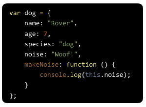

**WDI Fundamentals Unit 10**

---

#### Typeform Admin Link: 

https://admin.typeform.com/form/3050151/fields/#/

#### Typeform Embed: 

---

*Question 1*

One advantage of using ordinary arrays over using objects is that arrays allow us to associate keys with values, making it easier to access data.

- true
* false

_Response_

When working with ordinary arrays, we'll need to use index numbers to access values.

When working with objects, we can associate a key with a value, which makes it easier to access data as our applications grow in complexity.

---

*Question 2*

Please fill in the following: When using objects, values are accessed by ___? 

- Indexes
* Keys
- Properties
- Methods

_Response_

Properties of an object are composed of key value pairs and the value is accessed by the key.

---

*Question 3*

What is a method? 

- A key-value pair
- An array
* A function
- An object

_Response_

Methods are the actions (i.e., functions) that can be performed on objects.

---

*Question 4*

Given the code below, how would you change the value for the username key to "GA-Staff"

* loginInfo.username = "GA-Staff"; 
- loginInfo."username" = "GA-Staff"; 
- loginInfo[username, "GA-Staff"]; 
- loginInfo(username, "GA-Staff");

_Response_

To update values using dot notation, we use the name of the object (in this case, loginInfo), followed by a dot . followed by the name of the property we want to update (in this case, username).

We then use the assignment operator (=), followed by the new value.

---

*Question 5*

Using dot notation, how would you write code to access the **password** property of the **loginInfo** object.

* loginInfo.password;
- loginInfo."password";
- loginInfo("password");
- loginInfo(password);

_Response_

When working with objects, we can access values using the object name, followed by a period ., followed by the name of the property we want to access. Like so:

loginInfo.password;

---

*Question 6*

What code would we use to access, or call, the scribble method for the pencil object:

- scribble();
- pencil.scribble;
- pencil(scribble);
* pencil.scribble();

_Response_
When working with objects, we can access call using the object name, followed by a period, followed by the name of the method we want to call and ending with parenthesis. Like so:

pencil.scribble();

---

*Question 7*

There is a syntax error in the object below. Which of the following adjustments will make this code correct? 

- firstName: "Clark";
* revealIdentity: function () {
- return firstName + " " + lastName;
- var superman {

_Response_

The semicolon (:) is missing after the revealIdentity method name in the object above:

revealIdentity: function () {

---

*Question 8*

Look at the following code. What is **this** referring to? 

- "Rover"
* dog
- makeNoise
- "Woof!"

_Response_

In the context of our objects, **this** is used in place of the object name to refer to the object.

Here **this** is referring to the **dog** object.

---

*Question 9*

Look at the following code. What will be logged to the console? 

- "Rover"
- dog
* "Woof!"
- noise

_Response_

In the context of our objects, **this** is used in place of the object name to refer to the object.

Because **this.noise** is referring to the **dog** object, "Woof!" will be logged to the console.

---

*Question 10*

What do we use JSON objects for?

- To parse HTML elements into a DOM tree.
- To make as many objects as we want from this template.
- To access methods in an object.
* To transfer data between applications and JavaScript.

_Response_

JSON (JavaScript Object Notation) is a lightweight, text-based data format that's based on JavaScript.

We use JSON to transfer data between applications and JavaScript.
