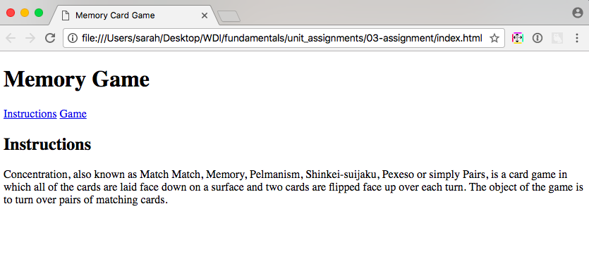

**WDI Fundamentals Unit 3**

---

# Introduction to HTML

In this unit, we've already covered some of the core fundamentals of web development, including how the internet works as well as how websites are structured and styled.

As you move through the next several chapters, you will be building parts of a browser-based **Memory Card Game**. Eventually, once all of the pieces are complete, your game will be turned in as your final assignment for WDI Fundamentals. Each chapter will introduce you to new tools and ideas, and it will be your job to figure out how to incorporate and use these tools to complete the assignment.

With your newfound knowledge from this unit, let's go ahead and create the foundation of our Memory Card Game app. The goal of this exercise is to build the primary structure of the website where we will build our memory card game.

## Exercise

#### Requirements

* Use a `title` element to give the game a unique title, which should be displayed in the browser tab.
* Use an `h1` element to provide a heading for the game.
* Include a subheading titled "Instructions", and add a paragraph explaining how the Memory Card Game is played.



##### Here are the steps to complete your assignment:

0. In the `fundamentals` folder you created in your home directory, create a new folder called `memory_game`.

0. Open up Sublime Text Editor.

0. Go to `File` > `Open...` and select the `memory_game` folder you created in the first step.

0. Right click on the folder in the sidebar in Sublime and select the `New File` option. 

0. This should open a new tab in Sublime that says `untitled`. Save this new file called `index.html`. Be sure to save it in the `memory_game` folder.

0. In this file, set up your HTML boilerplate code.

0. Add a `title` element so the name of the game (`Memory Card Game`) shows in the browser tab.

0. Create level one heading tags (`h1`) and add in the name of the game &mdash; `Memory Game` within those tags.

0. Add in two anchor elements &mdash; one should read `Instructions` and the other should read `Game`. For now you can just use `#` for the value for the `href` attribute like so:

	```html
	<a href="#">Anchor Text</a>
	```

0. Add in level two heading tags (`h2`) and add the text  `Instructions` within those tags.

0. Below your level two heading tags, type the following text in between paragraph (`p`) tags:

	*Concentration, also known as Match Match, Memory, Pelmanism, Shinkei-suijaku, Pexeso or simply Pairs, is a card game in which all of the cards are laid face down on a surface and two cards are flipped face up over each turn. The object of the game is to turn over pairs of matching cards.*

0. Great! In order to preview your page, right-click your `index.html` file and select "Open in Browser." If you want to make changes to your page and view those updates in the browser, simply make sure your file is saved before refreshing the page in the browser.


#### Bonus

* Add another subheading to describe your game. What's fun about it? Why should people play?

* Include some personal social media links so your users can learn about the developer behind the game - you!


>**NOTE** We'll dive deeper into adding color and other style customizations in the next unit.


---

[Great! You're ready for Unit 4.](../04_unit/intro-to-css-intro.md)
