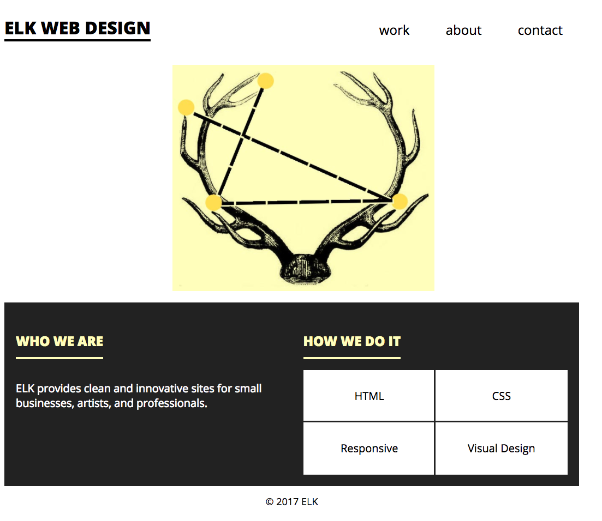

**WDI Fundamentals Unit 6**

---

## Your Turn

### Column Layout Exercise

This is the final part of our ELK Web Design site! Here, we'll become more familiar with positioning elements and images using floats. Remember, floats pull whatever element they're applied to out of the normal document flow. They're your secret weapon for positioning HTML elements on a page!

### Instructions
If you don't see the JS Bin below, please refresh the page.

Here's the editor you should use to write your code:

<a class="jsbin-embed" href="http://jsbin.com/libewe/embed?html,css,output">ELK Web Design on jsbin.com</a>

1) Write a rule for `div` that includes a `font-size` of `20px`. Set `div` to stretch across `50%` of the screen's `width`.

2) Set both `div`s to display as `inline-block` elements.

3) Remember that both of our `div`s have a class attribute: "about" and "services". Create CSS rules for `.about` and `.services`.

4) Give `.about` a `float` of `left`.

5) Give `.services` a `float` of `right`.

At this point, you'll notice a few problems with our page:
* The two columns are smushed together.
* The footer is behaving oddly.

6) Let's start with the quickest fix. Give the footer a `clear` value of `both`.

7) Now the footer is in the right place, but the two columns are still too close together! What do you know about adding white space between HTML elements? Currently, each of our `div`s take up `50%` of the page `width`. Consider this math: We want to borrow from the page's `width` to add a `2%` `padding` on all four sides, so that each `div` keeps a _total_ `width` of `50%`. So, go ahead and change the `width` to `46%` and add a `padding` of `2%`.

Fabulous!

8) Now, let's box up and position the four listed services in the right-hand column.

  * Create an `li` rule, and give it a `float` of `left`.
  * Set its `width` to `50%` and its `height` to `96px`.

9) Set `li` to have an `outline` value of `3px solid #222222`.

10) Set the `li`s to have a `text-align` of `center` and `line-height` of `96px`.

*Well done! The basics of the multi-column layout are all laid out. Now we can add a few visual elements to finish the design.*

11) Assign `img` a `width` of `480px`.

12) Switch to your HTML and wrap a new `div` around the main image. Give it a class called "hero".

*What happened to our image? The "hero" `div` is adhering to the styles written in the `div` selector, which we only wanted for our columns. Let's prevent that from happening.*

13) You can overwrite the styles set in the `div` selector by setting new styles us the "hero" class. Set `.hero` to a `width` of `100%`, a `display` of `block`, and a `margin` of `0`.

14) In your HTML, wrap a section around both `div`s; open it after the `header` closing tag, and close it before the opening `footer` tag.

15) Create a CSS rule for the `section`. Set its `background` to `#222222` and make its `color` `white`. Set the `section`'s `overflow` to `auto`.

16) Set the `h2` `color` to pale yellow: `#fffebb`. Set `h2`'s `border-bottom` to `#fffebb` as well.

17). Set the `li` `color` to `black` and its `background` to `white`.

Bravo! Well done.

Here's what your design should now look like:

---

[Time to test your knowledge!](navigation-and-page-layout-quiz.md).
