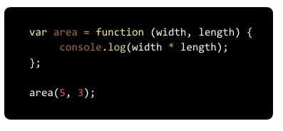

**WDI Fundamentals Unit 9**

---

#### Typeform Admin Link: 

https://admin.typeform.com/form/2905710/fields/#/

#### Typeform Embed: 

<!-- Change the width and height values to suit you best -->

---

*Question 1*

Which of the following is **not** an advantage of using a function? 

* Functions always take in inputs through parameters.
- Statements can be grouped together to perform a specific task.
- Functions are reusable.
- Steps can be stored and not executed each time a page loads.

_Response_

Functions allow us to group code together, store it, and use it many times.

---

*Question 2*

How would you write code to call this function with the number 5 as an argument.

- myFunction();
- myFunction("5");
- myFunction 5
* myFunction(5);

_Response_

Javascript functions are executed or "called" by appending () to the function name. To call this function with 5 as an argument, we would write:

myFunction(5);

---

*Question 3*

Look at the following code. Which of these is a parameter? 

- area (on line 1)
- width * length
* width (on line 1)
- 5

_Response_

Parameters are the variables defined in the function's declaration when the function is defined. In this example, the parameters are width and length.

---

*Question 4*

Look at the following code. Which of these is an argument? 

- area (in line 1)
- width * length
- width (in line 1)
* 5

_Response_

Arguments are the actual values passed into the function when the function is called. In this example, the arguments are 5 and 3.

---

*Question 5*

What will be logged to the console when the following function is called:

- "You'll need to order 9 pizzas"
- "You'll need to order numberPizzas pizzas"
* "You'll need to order 3 pizzas"
- "You'll need to order 4 pizzas"

_Response_

Here we are passing in the argument 9 for numberPeople and, within the function, we are setting numberPizzas to numberPeople (which is 9) divided by 3.

Therefore "You'll need to order 3 pizzas." will be printed to the console.

---

*Question 6*

How would you write code to call the orderPizzas function so that "You'll need to order 6 pizzas." is logged to the console.

* orderPizzas(18);
- orderPizzas();
- orderPizzas("18");
- orderPizzas(6)

_Response_

In order to have "You'll need to order 6 pizzas." logged to the console, we'll want to pass in 18 as the argument when we call the orderPizzas function like so:

orderPizzas(18);

---

*Question 7*
Look at the following code. Where will the function stop if x is 10? 

- After "return 100;"
- After "return 8;"
* After "return x;"
- After "if (x < 15);"

_Response_

When we return something, it ends the function's execution and "spits out" whatever we are returning.

Because x is greater than eight, the first "if" condition is false. But even after adding 3 to x with x += 3, x will be less than 15 which means that the second "if" statement condition is true, and the interpreter will run the line "return x;" and will stop running.

---

*Question 8*

What value will be returned when the lightOrDark function is called?

- "It's dark outside!"
* "It's light outside!"
- 12
- undefined

_Response_

Since we are providing 12 as the argument when we call the lightOrDark function, the result variable will get set to "It's light outside!" and will be returned from the function when this line of code runs:

return result;

---

*Question 9*

Look at the following code. In this function which use of x would cause an error because of scope? 

- var x = 9;
- var a = x + y;
* var b = x + y;
- None of the above

_Response_

Because x is declared inside of the add function it is a local variable that can only be used within the add function.

---

*Question 10*

Look at the following code:

In this function which use of x would cause an error because of scope? 

- var x = 9;
- var a = x + y;
- var b = x + y;
* None of the above

_Response_

Since x and y are declared outside of a function they are global variables that can be used in any function, as well as outside.